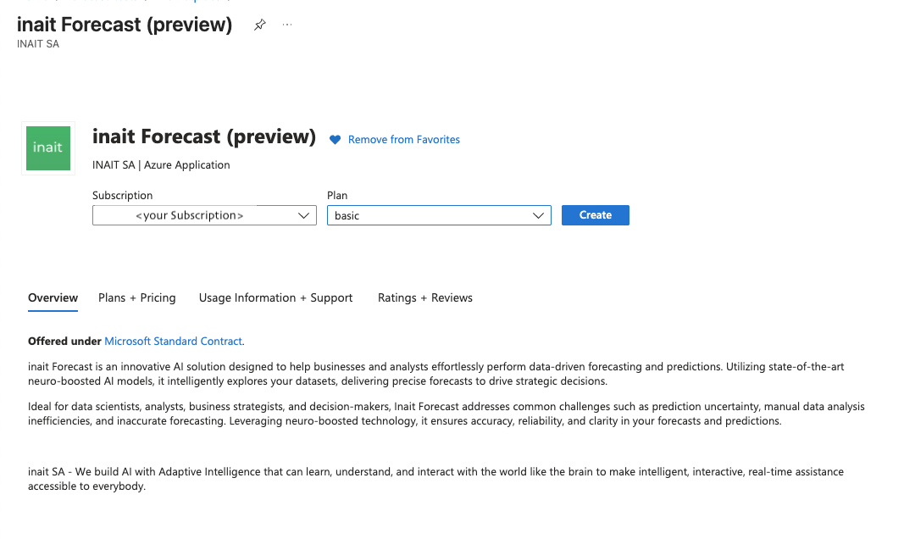
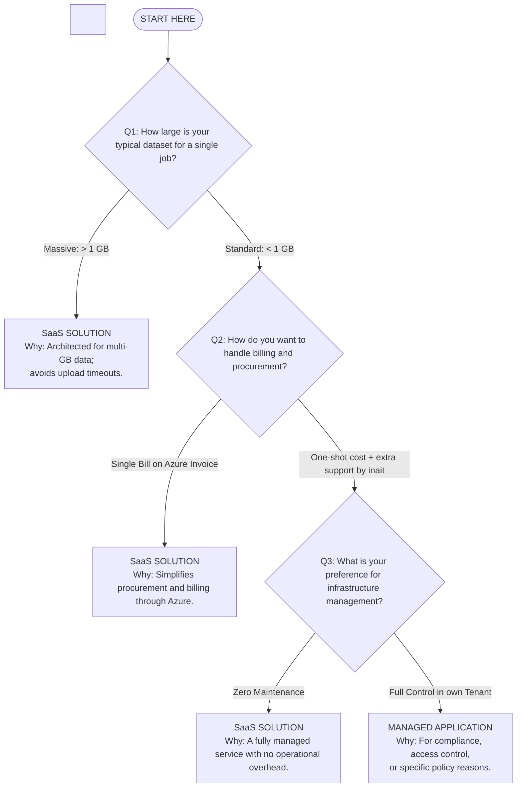

[](https://mybinder.org/v2/gh/inait-external/inait-forecast-docs/HEAD)

# 🛠️ Marketplace Examples

**inait** builds production-grade, enterprise-ready AI solutions that unlock the value of your data — fast.

This repository gives you hands-on, technical examples for deploying, integrating, and operationalizing inait’s flagship forecasting engine and other marketplace-ready AI tools. Every example is designed for rapid onboarding and real-world scalability, helping you move from proof-of-concept to business impact in days, not months.

Our Azure Marketplace applications are trusted by leading organizations for:

- Reliable, explainable AI forecasts for sales, demand, prices, and energy
- Seamless deployment in your Azure tenant — with zero infrastructure headaches
- API-first integrations, interactive notebooks, and transparent model selection
- Secure, compliant, and built for scale

---

## 🔮 Inait Forecasting (Azure Marketplace)
[](https://portal.azure.com/#view/Microsoft_Azure_Marketplace/GalleryItemDetailsBladeNopdl/id/inaitsa1696941874379.inait_forecast-preview/)

**Direct Azure deployment:**  
If you have access, [deploy the Managed App now](https://portal.azure.com/#view/Microsoft_Azure_Marketplace/GalleryItemDetailsBladeNopdl/id/inaitsa1696941874379.inait_forecast-preview/).

> _Don’t see the app or don’t have access?_  
> [Contact us](mailto:contact@inait.ai) for a **private invitation** to the preview offer.

---

## 🌟 About the Basic Plan



> The **Basic plan** provides essential access to core forecasting and prediction capabilities of Inait Forecast. Ideal for users exploring neuro-boosted AI analytics, this plan allows you to evaluate how effectively Inait technology can enhance your data-driven decisions with accurate and reliable predictions.

Inait Forecast is an innovative AI solution designed to help businesses and analysts effortlessly perform data-driven forecasting and predictions. Utilizing state-of-the-art neuro-boosted AI models, it intelligently explores your datasets, delivering precise forecasts to drive strategic decisions.

---

## 📦 Available Examples

### 🔮 [Inait Forecasting Examples](./inait-predict-examples/)

A robust, easy-to-use time series forecasting platform — now available for fast deployment from [Azure Marketplace](https://portal.azure.com/#view/Microsoft_Azure_Marketplace/GalleryItemDetailsBladeNopdl/id/inaitsa1696941874379.inait_forecast-preview/).

- 🏆 5 intelligent models for any use case
- 🚀 Ready-to-use notebooks and API examples
- 📊 No ML expertise required
- 🧑‍💻 [Jump to setup & demo ›](./inait-predict-examples/)

---

## 🧭 Repo Structure

| Folder                  | Purpose                                             |
|-------------------------|-----------------------------------------------------|
| `inait-predict-examples/` | Forecasting example suite and documentation         |
| `client/`               | Integration code and API clients                   |
| `data/`                 | Sample datasets                                    |
| `notebook-examples/`    | Interactive Jupyter notebooks                      |
| `Makefile`              | Project setup and development tools                |
| `sample.env`            | Template for API credentials                       |

---

## 🚀 Getting Started

### Quick Setup

1. **Install dependencies and set up the environment:**
   ```bash
   make init
   ```

2. **Configure API credentials:**
   ```bash
   cp sample.env .env
   # Edit .env with your API_BASE_URL and API_AUTH_KEY
   ```

3. **Start exploring with Jupyter notebooks:**
   ```bash
   uv run jupyter lab
   ```

Each example contains its own README with specific setup and usage guidelines.
Start with the [Inait Forecasting Examples](./inait-predict-examples/) for the fastest onboarding experience.

---

## (Soon to come - **SaaS**) 🧭 Which Solution is Right for You?


*Turn your data into real business results — with inait’s enterprise AI solutions.*
