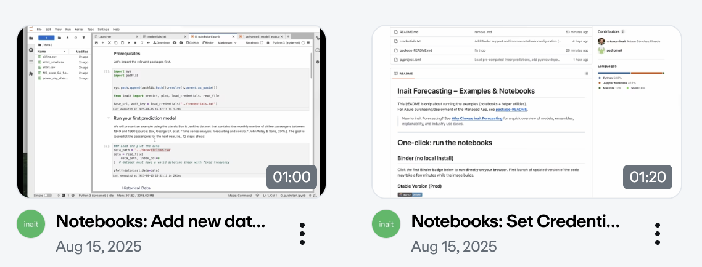

# Inait Forecasting – Examples & Notebooks

This README is **only** about running the examples (notebooks + helper utilities). For Azure purchasing/deployment of the Managed App, see **[package-README](./package-README.md)**.

> New to inait Forecasting? See **[Why Choose inait Forecasting](./package-README.md#why-choose-inait-forecasting)** for a quick overview of models, ensembles, explainability, and industry use cases.

---

# One‑click: Run the Notebooks

## Binder (no local install)
Click the first **Binder badge** below to **run directly on your browser**.
First launch of updated version of the code may take a few minutes while the image builds.

### Stable Version (Prod)

[](https://mybinder.org/v2/gh/inait-external/inait-forecast-docs/prod)

#### Latest Version (Unstable)

[](https://mybinder.org/v2/gh/inait-external/inait-forecast-docs/HEAD)

### Configure API access

**A) `credentials.txt` (default used by notebooks)**  
Create/edit a `credentials.txt` at the repo root:
```bash
API_BASE_URL='https://<your-forecast-endpoint>'
API_AUTH_KEY='<your-api-key>'
```

**Note:** If it's the first time you run Jupyter notebooks, you can click on **"Run"** at the top menu and select **"Run All Cells"**.

## Video tutorials (get clarity about 2 min)

* [Notebooks: Set Credentials and Run](https://vimeo.com/1110294635/fb1f373c02) ( < 80 sec )
* [Notebooks: Add new data and tailor the code](https://vimeo.com/1110308096/6b93267578) ( < 60 sec )




----

## GitHub Codespaces

Click the Codespaces badge. On first start, the dev container installs `uv`, runs `make init` to create `.venv`, and registers the **Python (inait‑uv)** kernel. Open `notebook-examples/` and start any notebook.

[](https://codespaces.new/inait-external/inait-forecast-docs?quickstart=1)

----

## Local (uv)

```bash
# 1) Install uv (Linux/macOS)
curl -LsSf https://astral.sh/uv/install.sh | sh

# 2) From the repo root, set up deps (creates .venv from pyproject.toml)
make init   # or: uv sync

# 3) Launch JupyterLab
uv run jupyter lab
```

---

## Configure API access

**A) `credentials.txt` (default used by notebooks)**  
Create/edit a `credentials.txt` at the repo root:
```bash
API_BASE_URL='https://<your-forecast-endpoint>'
API_AUTH_KEY='<your-api-key>'
```

**B) `.env` (supported via python‑dotenv)**  
Create `.env` at the repo root:
```ini
API_BASE_URL="https://<your-forecast-endpoint>"
API_AUTH_KEY="<your-api-key>"
```

> Don’t have an endpoint yet? See **[package-README](./package-README.md)** to deploy the Managed App and obtain credentials.

---

# Notebook catalog

Run top‑to‑bottom:

| Notebook | What it shows |
|---|---|
| `notebook-examples/0_quickstart.ipynb` | Start here. Configure credentials, submit your first forecast, and visualize results. |
| `notebook-examples/1_advanced_model_evaluation.ipynb` | Compare various versions of inait forecasting models against open-source baselines on the ETTh1 electricity transformer dataset. |
| `notebook-examples/2_energy_forecast_interpretability.ipynb` | Use inait explainability feature to understand which factors drive energy price predictions. |
| `notebook-examples/3_sales_forecast_with_uncertainty.ipynb` | Sales forecasting with prediction intervals (uncertainty bands). |

---

## Sample data

Small CSVs live in `data/`:

- `data/airline.csv` – classic monthly airline passengers  
- `data/etth1.csv` / `data/etth1_small.csv` – ETTh1 energy transformer dataset (full and small)  
- `data/M5_store_CA_1.csv` – M5 competition dataset (single-store sales sample)  
- `data/power_day_ahead.csv` – German day-ahead hourly electricity prices, including exogenous factors

**Expected format** (simplified):

- A timestamp column with consistent frequency (hourly, daily, …)  
- One or multiple numeric columns: one or more target columns to forecast and optional exogenous variables all aligned to the same timestamps

---

# Optional: Python helpers & CLI

Lightweight utilities live under `inait/`:

```bash
# Show command help
uv run python -m inait.prediction_script --help
uv run python -m inait.plot_script --help
uv run python -m inait.explanation_script --help
```

---

# Troubleshooting

- **Kernel mismatch (Codespaces)**: ensure the notebook kernel is **Python (inait‑uv)**.  
- **Import errors in terminal**: `uv sync && source .venv/bin/activate`.  
- **Auth errors (401/403)**: check `API_AUTH_KEY` and tenant for your endpoint.  
- **Background jobs**: some examples poll until completion—keep the cell running.
- **Issues**: https://github.com/inait-external/inait-forecast-docs/issues
- **Email**: contact@inait.ai


**Next:** Azure purchase & deployment → **[package-README](./package-README.md)**
