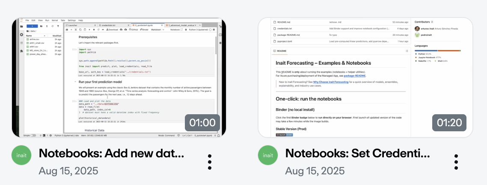

# Inait Forecasting – Examples & Notebooks

This README is **only** about running the examples (notebooks + helper utilities). For Azure purchasing/deployment of the Managed App, see **[package-README](./package-README.md)**.

> New to inait Forecasting? See **[Why Choose inait Forecasting](./package-README.md#why-choose-inait-forecasting)** for a quick overview of models, ensembles, explainability, and industry use cases.

---

<details>
<summary><strong>Table of Contents</strong></summary>

- [One‑click: Run the Notebooks](#oneclick-run-the-notebooks)
  - [Binder (no local install)](#binder-no-local-install)
  - [GitHub Codespaces](#github-codespaces)
  - [Local (uv)](#local-uv)
- [Configure API access](#configure-api-access-1)
- [Notebook catalog](#notebook-catalog)
- [Sample data](#sample-data)
- [Python Client Library](#python-client-library)
- [Troubleshooting](#troubleshooting)

</details>

---

# One‑click: Run the Notebooks

## Binder (no local install)
Click the first **Binder badge** below to **run directly on your browser**.
First launch of updated version of the code may take a few minutes while the image builds.

### Stable Version (Prod)

[](https://mybinder.org/v2/gh/inait-external/inait-forecast-docs/prod)

#### Latest Version (Unstable)

[](https://mybinder.org/v2/gh/inait-external/inait-forecast-docs/HEAD)

### Configure API access

**A) `credentials.txt` (default used by notebooks)**  
Edit the file `credentials.txt` at the root of the repo adding the following two lines, edit only the key value, replacing it with yours:
```bash
API_BASE_URL='https://api.forecasting.inait.ai/forecasting'
API_AUTH_KEY='your-api-key-string'
```

## Video tutorials (get clarity in about 2 min)

* [Notebooks: Set Credentials and Run](https://vimeo.com/1110294635/fb1f373c02) ( 80 sec )
* [Notebooks: Add new data and tailor the code](https://vimeo.com/1110308096/6b93267578) ( 60 sec )



**Notes:**
* If it's the first time you run Jupyter notebooks, start by clicking on **"Run"** at the top menu and select **"Run All Cells"**.
* If you get a `timeout error`, please just restart the Kernel and give it another try.

----

## GitHub Codespaces

Click the Codespaces badge. On first start, the dev container installs `uv`, runs `make init` to create `.venv`, and registers the **Python (inait‑uv)** kernel. Open `notebook-examples/` and start any notebook.

[](https://codespaces.new/inait-external/inait-forecast-docs?quickstart=1)

### Configure API access

**A) `credentials.txt` (default used by notebooks)**  
Edit the file `credentials.txt` at the root of the repo adding the following two lines, edit only the key value, replacing it with yours:
```bash
API_BASE_URL='https://api.forecasting.inait.ai/forecasting'
API_AUTH_KEY='your-api-key-string'
```
----

## Local (uv)

```bash
# 1) Install uv (Linux/macOS)
curl -LsSf https://astral.sh/uv/install.sh | sh

# 2) From the repo root, set up deps (creates .venv from pyproject.toml)
make init   # or: uv sync

# 3) Launch JupyterLab
uv run jupyter lab
```

---

### Configure API access

**A) `credentials.txt` (default used by notebooks)**  
Create/edit a `credentials.txt` at the repo root:
```bash
API_BASE_URL='https://api.forecasting.inait.ai/forecasting'
API_AUTH_KEY='your-api-key'
```

**B) `.env` (supported via python‑dotenv)**  
Create `.env` at the repo root:
```ini
API_BASE_URL="https://api.forecasting.inait.ai/forecasting"
API_AUTH_KEY="your-api-key"
```

> Don’t have an endpoint yet? See **[package-README](./package-README.md)** to deploy the Managed App and obtain credentials.

---

# Notebook catalog

## Core Examples (`notebook-examples/`)

Run top‑to‑bottom:

| Notebook | What it shows |
|---|---|
| `notebook-examples/0_quickstart.ipynb` | **Start here.** Configure credentials, submit your first forecast using the airline passenger dataset, and visualize results. |
| `notebook-examples/1_advanced_model_evaluation.ipynb` | Compare `inait-basic`, `inait-advanced`, and `inait-best` models on the ETTh1 electricity transformer benchmark dataset. |
| `notebook-examples/2_energy_forecast_interpretability.ipynb` | Use inait explainability features to understand which factors drive energy price predictions. |
| `notebook-examples/3_sales_forecast_with_uncertainty.ipynb` | Sales forecasting with prediction intervals (uncertainty bands) using M5 competition data. |

## Advanced Examples (`futurecomplete-examples/`)

Comprehensive forecasting workflows with backtesting and model comparison:

| Notebook | What it shows |
|---|---|
| `futurecomplete-examples/frontiers_articles.ipynb` | Scientific article submission forecasting using FMSA dataset with backtesting and model comparison. |
| `futurecomplete-examples/power.ipynb` | German electricity price forecasting with exogenous variables (load, consumption) and comprehensive evaluation. |
| `futurecomplete-examples/volatility_aapl.ipynb` | Financial volatility forecasting for Apple stock with advanced time series techniques. |
| `futurecomplete-examples/volatility_sp100.ipynb` | S&P 100 volatility forecasting demonstrating portfolio-level risk modeling. |

---

## Sample data

Small CSVs live in `data/`:

### **Core Datasets**
- `data/airline.csv` – Classic monthly airline passengers time series (Box & Jenkins dataset)
- `data/etth1.csv` / `data/etth1_small.csv` – ETTh1 energy transformer dataset (full and small versions)
- `data/M5_store_CA_1.csv` – M5 competition dataset (single-store sales sample)
- `data/power_day_ahead.csv` – German day-ahead hourly electricity prices with exogenous factors

### **Financial & Volatility Data**
- `data/dataset_GKYZ_2016.csv` – Financial dataset for GKYZ volatility modelling with 100 stocks
- `data/dataset_GKYZ_2016_AAPL.csv` – Apple stock data for volatility modeling

### **Scientific & Research Data**
- `data/FMSA_Articles.csv` – Frontiers in Marine Science article submissions (academic forecasting)

**Expected format** (simplified):

- A timestamp column with consistent frequency (hourly, daily, …)  
- One or multiple numeric columns: one or more target columns to forecast and optional exogenous variables all aligned to the same timestamps

---

## Python Client Library

All examples use the `inait-forecasting-client` package which provides:

```python
from inait_forecasting_client import (
    predict,      # Submit forecasting jobs
    plot,         # Visualize results
    read_file,    # Load data with proper formatting
    backtest,     # Model evaluation and validation
    compare,      # Compare multiple models
)
```

**Key Features:**
- **Simple API**: Submit forecasts with just a few lines of code
- **Auto-visualization**: Built-in plotting for results and diagnostics  
- **Flexible data loading**: Supports CSV, Excel, and pandas DataFrames
- **Model comparison**: Built-in backtesting and performance evaluation (scores included in results)

---

## Troubleshooting

- **Kernel mismatch (Codespaces)**: ensure the notebook kernel is **Python (inait‑uv)**.  
- **Import errors in terminal**: `uv sync && source .venv/bin/activate`.  
- **Auth errors (401/403)**: check `API_AUTH_KEY` and tenant for your endpoint.  
- **Background jobs**: some examples poll until completion—keep the cell running.
- **Issues**: https://github.com/inait-external/inait-forecast-docs/issues
- **Email**: contact@inait.ai


**Next:** Azure purchase & deployment → **[package-README](./package-README.md)**
