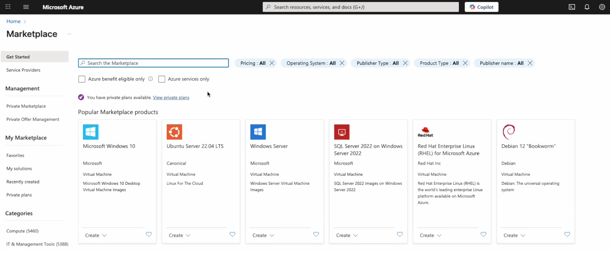
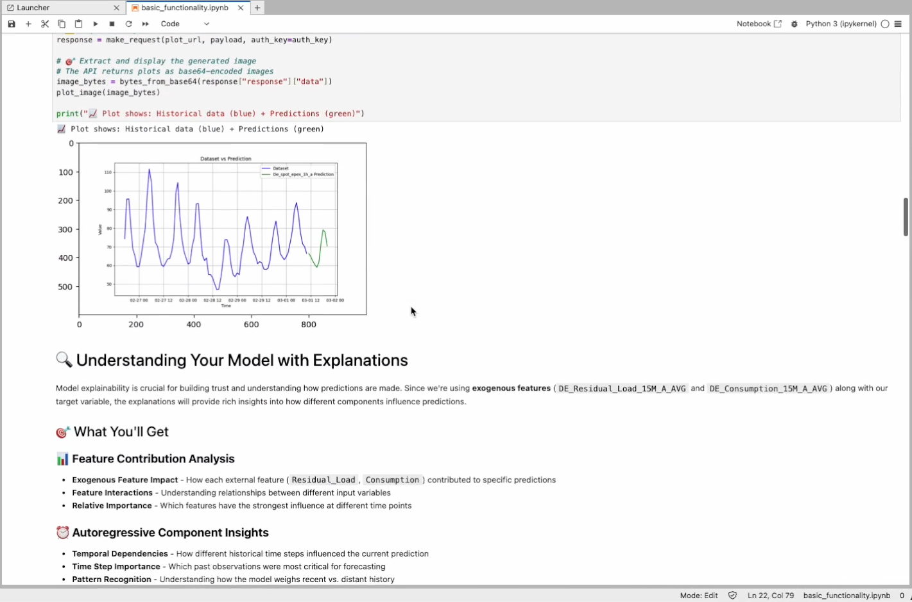

# 📈 Inait Forecasting: Azure Marketplace Quickstart

**inait Forecasting** delivers fast, reliable time series forecasting built for real business. Deploy in minutes, explore with code or notebooks, and get robust, explainable predictions — all from your own Azure environment.

Whether you’re predicting sales, demand, pricing, or energy, inait Forecasting lets you move from deployment to insight with enterprise-grade security and zero ML guesswork.

---

## 🚀 Deploy the Managed App

[](https://portal.azure.com/#view/Microsoft_Azure_Marketplace/GalleryItemDetailsBladeNopdl/id/inaitsa1696941874379.inait_forecast-preview/)

Deploy instantly via Azure Marketplace:
If you have access, [deploy the Managed App now](https://portal.azure.com/#view/Microsoft_Azure_Marketplace/GalleryItemDetailsBladeNopdl/id/inaitsa1696941874379.inait_forecast-preview/).

> _If you do not have access, [contact us](mailto:contact@inait.ai) for a private invitation to the preview._

---

## 🌟 About the Basic Plan


> The **Basic plan** provides essential access to core forecasting and prediction capabilities of Inait Forecast. Ideal for users exploring neuro-boosted AI analytics, this plan allows you to evaluate how effectively Inait technology can enhance your data-driven decisions with accurate and reliable predictions.

---
## 🛠️ Quick Setup

### Prerequisites
- [UV](https://docs.astral.sh/uv/) - Modern Python package manager
- Python 3.8+ (automatically handled by [UV](https://docs.astral.sh/uv/))
- Your URL and API key for inait Forecasting

---

## 🎬 Tutorial: Step-by-Step Videos
(*click each image to go to the video*)


### ▶️ Step 1: Deploy the App in Your Azure Tenant
This video shows how to install the forecasting app into your own Azure tenant. **Wait up to 20 minutes for provisioning to complete — go grab a coffee.**

<a href="https://vimeo.com/1102971647#t=0s" title="Click to watch: Deploy the App in Your Azure Tenant">
  
</a>

---

### ▶️ Step 2: Set Up Notebooks and API Access
Learn how to clone the repo, fetch your credentials, and configure notebooks. You’ll be ready to run live forecasts in just a few minutes.

<a href="https://vimeo.com/1102971647#t=1m05s" title="Click to watch: Set Up Notebooks and API Access">
  
</a>

---

### Getting Started
1.  **Clone and navigate to the directory:**
    ```bash
    cd inait-predict-examples
    ```
2.  **Run the setup script:**
    ```bash
    ./setup.sh
    ```
3.  **Start Jupyter Lab:**
    ```bash
    uv run jupyter lab
    ```
4.  **Open the example notebooks:**
    Navigate to the `notebook-examples/` folder and choose from:
    - `basic_functionality.ipynb` - Complete API overview and synchronous predictions
    - `background_ensemble_prediction.ipynb` or `prediction_intervals_visualization.ipynb` - Asynchronous processing for large datasets

### Alternative Setup (Manual)
```bash
# Install dependencies
uv sync

# Run Jupyter
uv run jupyter lab

# Or run a specific notebook
uv run jupyter notebook notebook-examples/basic_functionality.ipynb
```
---

### ▶️ Step 3: Run, Customize, and Explore
Walk through running the notebook cells, customizing inputs, and reviewing results. Swap in your own data and explore what's possible.

<a href="https://vimeo.com/1102971647#t=2m10s" title="Click to watch: Run, Customize, and Explore">
  
</a>

---

## 📊 Data Format Requirements

To ensure optimal performance with Inait Forecasting, your dataset must follow these formatting conventions:

### 📁 File Format
- **Supported Format**: CSV (Comma-Separated Values)
- **Encoding**: UTF-8 recommended
- **Headers**: First row must contain column names

### ⏰ Time Series Structure
- **Row Organization**: Each row represents a single timestamp observation
- **Temporal Ordering**: Rows must be sorted in **chronological order** (ascending timestamps)
- **Time Index**: Include a datetime column with consistent frequency
- **No Gaps**: Ensure regular time intervals (hourly, daily, etc.) without missing timestamps

### 📋 Required Columns

#### 🎯 Target Column
- **Purpose**: The variable you want to forecast
- **Name**: Can be any descriptive name (e.g., `"sales"`, `"price"`, `"demand"`)
- **Format**: Numeric values (integers or floats)
- **Example**: `"DE_Spot_EPEX_1H_A"` (electricity spot prices)

#### 📅 Time Index Column
- **Purpose**: Timestamp for each observation
- **Format**: ISO datetime format recommended (`YYYY-MM-DD HH:MM:SS`)
- **Frequency**: Must be consistent (e.g., hourly, daily, weekly)
- **Example**: `"2024-01-01 00:00:00"`, `"2024-01-01 01:00:00"`, etc.

#### 📊 Exogenous Feature Columns (Optional)
- **Purpose**: External variables that influence the target
- **Format**: Numeric values corresponding to each timestamp
- **Examples**:
  - `"DE_Residual_Load_15M_A_AVG"` (grid load data)
  - `"DE_Consumption_15M_A_AVG"` (consumption patterns)
  - `"temperature"`, `"promotion_active"`, `"day_of_week"`

### 📈 Example Dataset Structure
```csv
timestamp,DE_Spot_EPEX_1H_A,DE_Residual_Load_15M_A_AVG,DE_Consumption_15M_A_AVG
2024-01-01 00:00:00,45.23,32145.5,28932.1
2024-01-01 01:00:00,42.18,31245.2,27845.6
2024-01-01 02:00:00,38.95,30123.8,26789.3
2024-01-01 03:00:00,35.76,29456.1,25956.8
...
```
---

## 🏆 Why Choose inait Forecasting?

### Effortless Accuracy
- **5 Intelligent Models**: Choose from `basic`, `robust`, `neural`, `gradient_boost`, or `fast_boost` — each optimized for different data characteristics.
- **Automatic Model Selection**: Let inait Forecasting pick the best approach for your data.
- **Ensemble Power**: Combine multiple intelligent models for maximum accuracy and reliability.
- **Prediction Intervals**: Get confidence bounds, not just point estimates.

### Business-Ready Features
- **REST API Integration**: Deploy predictions in minutes with simple HTTP calls.
- **Background Processing**: For large datasets or complex models, the application works in background mode. Query the operation status and download results when ready.
- **Visual Insights**: Automatic chart generation for stakeholder presentations.

### Explainable AI
- **Model Transparency**: Understand exactly what drives your predictions with clear explanations.
- **Feature Importance**: See which variables matter most for your forecasts.
- **Interactive Insights**: Drill down into any prediction to build trust and understanding.

---

## 🏢 Perfect For Your Industry

### Retail & E-commerce
- **Demand Forecasting**: Optimize inventory with accurate sales predictions.
- **Price Optimization**: Predict market responses to pricing changes.
- **Seasonal Planning**: Handle complex seasonal patterns automatically.

### Finance & Trading
- **Market Prediction**: Forecast prices, volatility, and trading volumes.
- **Risk Management**: Predict default rates and financial metrics.
- **Economic Analysis**: Model economic indicators and market trends.

### Manufacturing & Supply Chain
- **Production Planning**: Forecast demand to optimize manufacturing schedules.
- **Maintenance Prediction**: Predict equipment failures before they happen.
- **Supply Chain Optimization**: Forecast lead times and inventory needs.

### Energy & Utilities
- **Load Forecasting**: Predict energy demand across different time horizons.
- **Renewable Integration**: Forecast solar and wind energy production.
- **Grid Management**: Optimize energy distribution and storage.

---

## 💬 Support

Questions? [Open an issue](https://github.com/inait-external/inait-forecast-docs/issues) or contact us at [contact@inait.ai](mailto:contact@inait.ai).

---

*inait Forecasting: Turn your data into business results — with enterprise-ready AI you can trust.*
