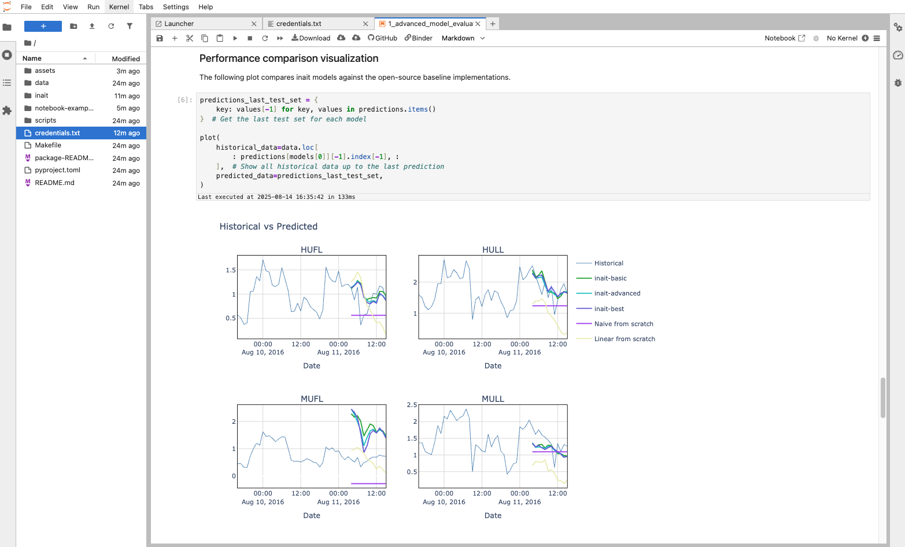

[](https://portal.azure.com/#view/Microsoft_Azure_Marketplace/GalleryItemDetailsBladeNopdl/id/inaitsa1696941874379.inait_forecast-preview/)

# Inait Forecasting on Azure Marketplace – Buy, Deploy, Connect

This guide explains **how to acquire and deploy** the inait Forecasting **Managed Application** in your Azure tenant and then connect it to the notebooks in this repo.  
To run the examples directly, see **[README](./README.md)**.

---

## What you get
- Enterprise‑ready **time‑series forecasting** with explainability  
- **Managed Application** hosted in **your** Azure subscription  
- Simple **REST API** used by our notebooks and helper scripts  
- Preview **Basic plan** suitable for evaluation and pilots

## Why Choose inait Forecasting?

### Effortless Accuracy
- **Several Intelligent Models**: *inait-basic*, *inait-advanced* and *inait-best*  

### Business‑Ready Features
- **REST API integration** in minutes  
- **Background processing** for large jobs (poll status, download when ready)  
- **Visual insights** for stakeholder‑friendly charts

### Explainable AI
- **Model transparency** and clear explanations  

### Perfect for Your Industry
**Retail & E‑commerce** – demand, price, and seasonal planning  
**Finance & Trading** – markets, risk, and economic indicators  
**Manufacturing & Supply Chain** – production, maintenance, and lead‑times  
**Energy & Utilities** – load, renewables, and grid optimization

#### Coming features
- **Automatic Model Selection** or manual choice  
- **Ensemble Power** for accuracy and robustness  
- **Prediction Intervals** (confidence bounds)
- **Interactive insights** to build trust
- **Feature importance** to see what drives forecasts  

---

## Deploy on Azure


1. Click **Deploy on Azure** above.  
2. Choose subscription, resource group, and region.  
3. Accept terms and **Create**.  
4. Wait for provisioning (**~10–20 minutes**).

**Find your endpoint & credentials**  
After deployment, locate the application’s **Base URL** in the resource details or deployment outputs and pair it with your **API key**.

---

## Connect the examples

Launch the examples via **Binder** or **Codespaces**, or run locally (see **[README](./README.md)**). Provide credentials using one of the methods below.

**A) `credentials.txt`**  
```bash
API_BASE_URL='https://<your-forecast-endpoint>'
API_AUTH_KEY='<your-api-key>'
```

**B) `.env`** (supported via `python-dotenv`)  
```ini
API_BASE_URL="https://<your-forecast-endpoint>"
API_AUTH_KEY="<your-api-key>"
```

Then open **`notebook-examples/0_quickstart.ipynb`**, run the validation cell, and continue with:
- **1_advanced_model_evaluation.ipynb** – advanced models & evaluation  
- **2_energy_forecast_interpretability.ipynb** – explanations & insights  
- **3_sales_forecast_with_uncertainty.ipynb** – prediction intervals

---

## Example results



---

## Data format requirements
- UTF‑8 CSV with header row, Excel files, parquet, others. 
- Please, see function `read_file` in utils.  

Example:
```csv
timestamp,DE_Spot_EPEX_1H_A,DE_Residual_Load_15M_A_AVG,DE_Consumption_15M_A_AVG
2024-01-01 00:00:00,45.23,32145.5,28932.1
2024-01-01 01:00:00,42.18,31245.2,27845.6
...
```

---

## Support
- Issues: https://github.com/inait-external/inait-forecast-docs/issues  
- Email: **contact@inait.ai**

**Back to examples:** [README](./README.md)
