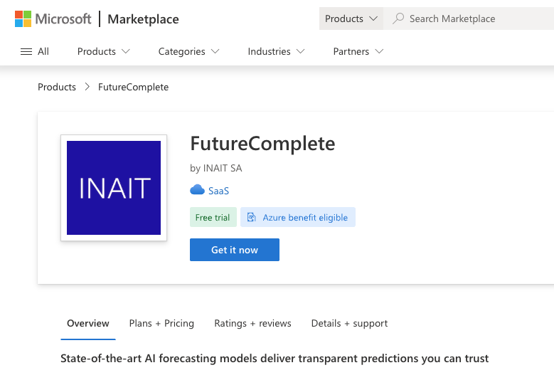

# FutureComplete on Azure Marketplace – Buy, Deploy, Connect

This guide explains **how to acquire and deploy** FutureComplete, inait forecasting tool, and then connect it to the notebooks in this repo.  
To run the examples directly, see **[README](./README.md)**.

---

## Deploy on Azure

or from **[Microsoft Marketplace](https://marketplace.microsoft.com/en-us/product/inaitsa1696941874379.inait_saaas_forecast)**

1. Click **Deploy on Azure** above.  
2. Choose subscription, resource group, and region.  
3. Accept terms and **Create**.  
4. Wait for provisioning (**~10–20 minutes**).

**Find your endpoint & credentials**  
After deployment, locate the application's **Base URL** in the resource details or deployment outputs and pair it with your **API key**.

Once you have your credentials, see the **[README](./README.md)** for instructions on how to configure them and run the examples.

---

## Support

- Issues: https://github.com/inait-external/inait-forecast-docs/issues  
- Email: **contact@inait.ai**
